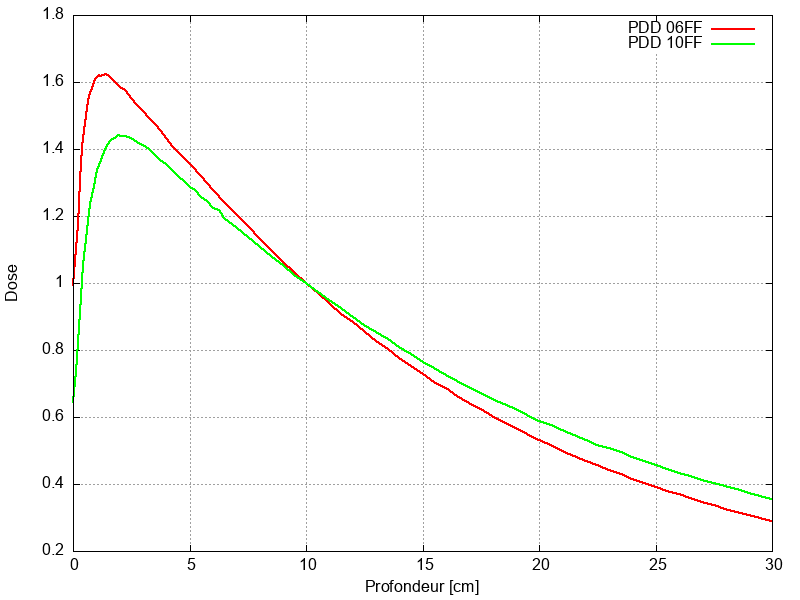

# Introduction

Pour la dosimétrie absolue des faisceaux sans cône égalisateur, il
faut tenir compte de la dose moyenne dans la chambre d'ionisation
(Farmer PTW 30012 voir la Fig.[2](#orgd3afd30)).

# Méthode

## Modélisation des faisceaux

La variation de dose autour du point de référence pour les deux
énergies concernées est modélisée avec des simplifications, parce que
la région considérée est petite (possibilité de linéariser le
rendement en profondeur, par exemple).

### Les rendements des deux énergies

Sur la fig.[7](#orga2d523f) sont représentées les deux courbes de rendements
(normées à 1 à 10 cm de profondeur). Autour de la profondeur de 10 cm,
les deux courbes sont approximées par une exponentielle (voir
Fig.[9](#org843f550)) selon l’équation :

$$
PDD(z)= e^{k \cdot (10-z)}
$$

Cette forme particulière impose qu'à la profondeur 10 cm ($z=10$), la valeur du
rendement passe par 1.

Le résultat des fits est présenté sur la figure [9](#org843f550). On
distingue à peine le fit des points mesurés.

### Modélisation de la forme de yourte

Pour chaque énergie, on doit modéliser à la profondeur de 10 cm, la
forme du profil radial pour les deux énergies, dans les conditions de
référence à savoir un faisceau de 10 x 10 cm. Le fit s'étalant de -2 à
+2 cm, il n'est pas nécessaire de retenir un courbe très
compliquée. Une parabole symétrique en 0 a été retenue.

$$
Profil(r)= 1 - q r^2
$$

En effet, la parabole est centrée et passe par 1 à l'origine. On
utilise $r$ pour insister sur le paramètre radial, $q$ étant le
paramètre de fit.

$$
r = \sqrt{x^2 + y^2}
$$

Les deux axes ont permis de fitter la parabole et la valeur $q$ finale
est la moyenne des deux axes $x$ et $y$:

$$
q = \frac{q_x + q_y}{2}
$$

#### Énergie 6 FFF

Le résultat du fit est présenté sur la figure [18](#org8a469a5). 

#### Énergie 10 FFF

Le résultat du fit est présenté sur la figure [21](#org689e2ef). 

Ainsi, avec les paramètres $a$ et q pour chaque énergie, on est
capable de déterminer la dose relative simplifiée autour du point de
référence par:

$$
dose(x,y,z) = PDD(z) \cdot Profil(r(x,y))
$$

Il ne reste plus qu'à déterminer la géométrie d'une chambre
d'ionisation Farmer.

## Géométrie de la chambre Farmer

La géométrie retenue correspond exactement à celle décrite par PTW
(Fig. [2](#orgd3afd30)) et également dans le rapport
IAEA-TRS483<a href="#citeproc_bib_item_1">[1]</a> (Fig. [26](#org1195721)). À noter
que le point central (point de référence de la chambre) est indiqué
par PTW comme étant sur l'axe de la partie cylindrique est à 13 mm en
retrait du nez de la chambre. Le bout de la chambre est à 2.36 cm sur
la figure [2](#orgd3afd30). Le texte de PTW nous indique 13 mm en
retrait. On doit se trouver à 1.06 cm soit pile au milieu de la partie
cylindrique indiquée ($L_{CE}=2.12 cm$). C'est de cette manière que la
chambre a été placée dans notre modélisation.

## Rapport des pouvoirs d'arrêt

Le METAS nous donne une correction du facteur de la chambre par
rapport au $^{60}Co$. Il se trouve que cette correction n'est valable
que pour les faisceaux avec cône égalisateur (WFF). Il faut appliquer
une correction supplémentaire pour obtenir le bon facteur pour un
faisceau sans cône égalisateur (FFF).

Dans l'article de <a href="#citeproc_bib_item_2">[2]</a>, deux fits sont proposés pour chacune des modalités

### Pour les WFF

    def Lrho_water_air_WFF(t):
        """
        t : TPR^20_10
        Fit de Czarnecki et al. 2017, Medical Physics
        Pour les rapport de pouvoir d'arrêt eau-air avec les cones égalisateurs (WFF)
        """
        value = -0.942215 * t**2 + 1.08739 * t + 0.81529
        return ufloat(value, value*0.0017)

### Pour les FFF

    def Lrho_water_air_FFF(t):
        """
        t : TPR^20_10
        Fit de Czarnecki et al. 2017, Medical Physics
        Pour les rapport de pouvoir d'arrêt eau-air sans les cones égalisateurs (FFF)
        """
        value = -0.945130 * t**2 + 1.04130 * t + 0.84365
        return ufloat(value, value*0.0015)

Pour un $TPR^{20}_{10}$ donné, il suffit d'applique le rapport de ces deux
valeurs pour obtenir le facteur nécessaire (rapport des rapports de
pouvoirs d'arrêt eau-air).

## Calculs numériques

On peut à l'aide de `scipy` calculer une intégrale triple de manière numérique:

$$
Volume_{Farmer} = \iiint_{Farmer}  \,dx\,dy\,dz
$$

En changeant pour des coordonnées cylindriques, le calcul sera plus
facile:

$$

\begin{equation}
\begin{array}{l}
x = r \cdot cos(\theta) \\
y = y \\
z = r \cdot sin(\theta) + \Delta_z
\end{array}
\end{equation}

$$

où $\Delta_z = 10 cm$, la profondeur de référence.

Le changement de coordonnées induit le Jacobien suivant:

$$

\begin{equation}
\mathbb{J}_{i,j} =
\begin{bmatrix}
  \frac{\partial x}{\partial r} & 
    \frac{\partial x}{\partial y} & 
    \frac{\partial x}{\partial \theta} \\[1ex] % <-- 1ex more space between rows of matrix
  \frac{\partial y}{\partial r} & 
    \frac{\partial y}{\partial y} & 
    \frac{\partial y}{\partial \theta} \\[1ex]
  \frac{\partial z}{\partial r} & 
    \frac{\partial z}{\partial y} & 
    \frac{\partial z}{\partial \theta}
\end{bmatrix}
\end{equation}

$$

Dont le déterminant se calcule par:

$$
 det( \mathbb{J}_{i,j} ) = 
\begin{vmatrix}
     cos(\theta) & 0 & -r \cdot sin(\theta)\\ 
         0       & 1 &       0\\
     sin(\theta) & 0 & r \cdot cos(\theta) 
\end{vmatrix} =
r \cdot cos^2(\theta) + r \cdot sin^2(\theta) = r
$$

Ainsi, le volume de la chambre Farmer se calcule par:

$$
Volume_{Farmer} = \int \int \int r  \,dr\ dy\ d\theta\
$$

Volume qu'on va décomposer en une partie cylindrique et une partie conique:

$$
Volume_{Farmer} = Volume_{cylindrique} + Volume_{conique}
$$

Avec (d'après PTW, le milieu de la chambre Farmer est au milieu de la partie cylindrique) :

$$
Volume_{cylindrique} = \int_0^{2\pi} \int^{\frac{L}{2}-\Delta_y}_{\frac{-L}{2}+\Delta_y} \int^{R}_{R_{CE}} r  \,dr\ dy\ d\theta\
$$

et:

$$
Volume_{conique} = \int_0^{2\pi} \int_{\frac{L}{2}-\Delta_y}^{\frac{L}{2}+\Delta_y} \int_{0}^{R_{CE}(1-\frac{y-\frac{L}{2}+\Delta_y}{2\Delta_y})} r  \,dr\ dy\ d\theta\
$$

Et ainsi la dose moyenne dans la chambre Farmer peut se calculer par:

$$
Dose_{Farmer} = \frac{Cumul_{cylindrique} + Cumul_{conique}}{Volume_{Farmer}}
$$

Avec:

$$
Cumul_{cylindrique} = \int_0^{2\pi} \int^{\frac{L}{2}-\Delta_y}_{\frac{-L}{2}+\Delta_y} \int^{R}_{R_{CE}} r \cdot PDD(z) \cdot Profil(dist) \,dr\ dy\ d\theta
$$

$$
Cumul_{cylindrique} = \int_0^{2\pi} \int^{\frac{L}{2}-\Delta_y}_{\frac{-L}{2}+\Delta_y} \int^{R}_{R_{CE}} r \cdot PDD(r \sin(\theta) + \Delta_z) \cdot Profil(\sqrt{x^2+y^2}) \,dr\ dy\ d\theta
$$

$$
Cumul_{cylindrique} = \int_0^{2\pi} \int^{\frac{L}{2}-\Delta_y}_{\frac{-L}{2}+\Delta_y} \int^{R}_{R_{CE}} r \cdot PDD(r \sin(\theta) + \Delta_z) \cdot Profil(\sqrt{(r \cos(\theta))^2+y^2}) \,dr\ dy\ d\theta
$$

De même pour la partie conique:

$$
Cumul_{conique} = \int_0^{2\pi} \int_{\frac{L}{2}-\Delta_y}^{\frac{L}{2}+\Delta_y} \int_{0}^{R_{CE}(1-\frac{y-\frac{L}{2}+\Delta_y}{2\Delta_y})} r \cdot PDD(r \sin(\theta) + \Delta_z) \cdot Profil(\sqrt{(r \cos(\theta))^2+y^2}) \,dr\ dy\ d\theta\
$$

# Résultats

On lance le script qui effectue les calculs via la commande:

$ ./plot.sh

Ce script fait tout les calculs y compris les fits pour les paramètres
de modélisation. Il lance à la fin avec une résolution de 160 dans les
trois directions (x, y, z), le script python pour calculer les
coefficients de correction de la dose moyenne dans le volume sensible
de la Farmer.

Le script python peut être invoqué directement au niveau du shell. Par
exemple pour obtenir de l'aide sur le fonctionnement du script:

$ <code>./determination_k_FFF.py</code> -h

Pour calculer avec une résolution de 320 dans les trois axes, il
suffit de lancer:

$ <code>./determination_k_FFF.py</code> -n 320

Et avec ces 320 itérations, on obtient:

## 06 FFF

$$ Volume = 0.6120 [cm^3]$$

$$k_{FFF} = 1.00290$$

## 10 FFF

$$ Volume = 0.6120 [cm^3]$$

$$k_{FFF}=1.00544$$

Avec une résolution de 640, on obtient:

## 06 FFF

$$ Volume = 0.6144 [cm^3]$$

$$k_{FFF} = 1.00290$$

## 10 FFF

$$ Volume = 0.6144 [cm^3]$$

$$k_{FFF}=1.00543$$

Et finalement avec une résolution de 1280, on obtient:

## 06 FFF

$$ Volume = 0.6158 [cm^3]$$

$$k_{FFF} = 1.00289$$

## 10 FFF

$$ Volume = 0.6158 [cm^3]$$

$$k_{FFF}=1.00543$$

## Résultats numériques à l'aide de scipy

### 06 FFF

$$ Volume = 0.6170 [cm^3]$$

$$k_{FFF} = 1.00299$$

### 10 FFF

$$ Volume = 0.6170 [cm^3]$$

$$k_{FFF} = 1.00560$$

## Avec une distribution de positionnement

### 06 FFF

$$k_{FFF} = 1.00313$$

### 10 FFF

$$k{FFF} = 1.00589$$

## Rapport des pouvoirs d'arrêt

### 06 FFF

$$L_WFF = 1.1267 \pm 0.0019$$
$$L_FFF = 1.1250 \pm 0.0017$$

Correction pour $k_Q$ fit du METAS basé sur des WFF pour obtenir des valeurs pour des FFF:

$$0.9985 \pm 0.0023$$

### 10 FFF

$$L_WFF = 1.1141 \pm 0.0019$$
$$L_FFF = 1.1086 \pm 0.0017$$

Correction pour $k_Q$ fit du METAS basé sur des WFF pour obtenir des valeurs pour des FFF:

$$0.9951 \pm 0.0023$$

## Combinaison des deux facteurs

### 06 FFF

$$k_{FFF} = 1.0016$$

### 10 FFF

$$k_{FFF} = 1.0009$$

# Conclusion

Au final la correction est vraiment mineure. Il s’agit juste de 1 ou 2
pour mille. Ceci parce que les deux corrections nécessaires sont
opposées. Elles sont chacune importante au demi pourcent, mais
s’annihile presque totalement dans la version complète.

Ces valeurs sont en accord avec les valeurs publiées par Das et
al.<a href="#citeproc_bib_item_3">[3]</a>. Elles sont également proches bien
que plus basses que les valeurs proposées par Kodoma et
al.<a href="#citeproc_bib_item_4">[4]</a>. Ce dernier article se base sur un
sondage des valeurs utilisées au Japon. L'article définitif pour les
corrections liées aux pouvoirs d'arrêt différents entre WFF et FFF
sont publiées par <a href="#citeproc_bib_item_2">[2]</a>.

# Bibliography

  

    
[1]

V. IAEA, Ed., <i>Dosimetry of Small Static Fields Used in External Beam Radiotherapy</i>. in Technical Reports Series, no. 483. Vienna: INTERNATIONAL ATOMIC ENERGY AGENCY, 2017. Available: <a href="https://www.iaea.org/publications/11075/dosimetry-of-small-static-fields-used-in-external-beam-radiotherapy">https://www.iaea.org/publications/11075/dosimetry-of-small-static-fields-used-in-external-beam-radiotherapy</a>

  

  

    
[2]

D. Czarnecki, B. Poppe, and K. Zink, “Monte Carlo-based investigations on the impact of removing the flattening filter on beam quality specifiers for photon beam dosimetry,” <i>Medical physics</i>, vol. 44, no. 6, pp. 2569–2580, 2017, doi: <a href="https://doi.org/https://doi.org/10.1002/mp.12252">https://doi.org/10.1002/mp.12252</a>.

  

  

    
[3]

I. J. Das, S. K. Dogan, and M. Gopalakrishnan, “Determination of the Prp and radial dose correction factor in reference dosimetry,” <i>Biomedical physics &#38; engineering express</i>, vol. 10, no. 2, p. 027003, Feb. 2024, doi: <a href="https://doi.org/10.1088/2057-1976/ad25bc">10.1088/2057-1976/ad25bc</a>.

  

  

    
[4]

T. Kodama <i>et al.</i>, “Survey on utilization of flattening filter-free photon beams in Japan,” <i>Journal of radiation research</i>, vol. 62, no. 4, pp. 726–734, May 2021, doi: <a href="https://doi.org/10.1093/jrr/rrab042">10.1093/jrr/rrab042</a>.

  

